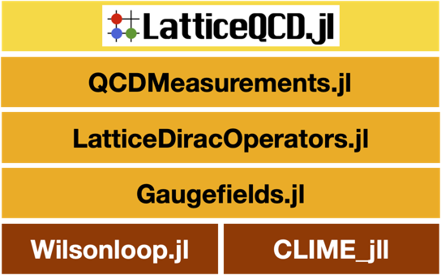

# Wilsonloop.jl [](https://github.com/akio-tomiya/Wilsonloop.jl/actions/workflows/CI.yml)

# Abstract
In Lattice Quantum Chromo-Dynamics (QCD), the gauge action is constructed by gauge invariant objects, Wilson loops, in discretized spacetime. 
Wilsonloop.jl helps us to treat with the Wilson loops and generic Wilson lines in any Nc and dimensions. 

This is a package for lattice QCD codes.

 

This package is used in [LatticeQCD.jl](https://github.com/akio-tomiya/LatticeQCD.jl)
and a code in a project [JuliaQCD](https://github.com/JuliaQCD/).

# What this package can do 
- From a symbolic definition of Wilson lines, this returns SU(Nc)-valued Wilson lines as objects
- Constructing all staples from given symbolic Wilson lines
- Constructing derivatives of given symbolic Wilson lines (auto-grad for SU(Nc) variables)

# How to install 

```julia
add Wilsonloop
```

# Notation warning
In Julia, adjoint represents *hermitian conjugate*, and we follow this terminology.

For example ``Adjoint_GLink`` means hermitian conjugate of a gauge link, not the link in the adjoint representation.

Please do not confuse with a link in the adjoint representation in conventional lattice QCD context.
We do not support links in adjoint representation.

# Basic idea

This package defines ```Wilsonline{Dim}``` type. 

```julia
mutable struct Wilsonline{Dim}
        glinks::Array{GLink{Dim},1}
end
```
This is a array of ```GLink{Dim}```.

The ```GLink{Dim}``` is defined as 

```julia
abstract type Gaugelink{Dim} end

struct GLink{Dim} <: Gaugelink{Dim}
    direction::Int8
    position::NTuple{Dim,Int64}
    isdag::Bool
end

```

```GLink{Dim}``` has a direction of a bond on the lattice and relative position $U_{\mu}(n)$.
The direction and position are obtained by ```get_direction(a)``` and ```get_position(a)```, respectively. 
For example if we want to have 2nd link of the Wilson loop ```w```, just do ```get_position(w[2])```. 


# How to use

## Plaquette and its staple
We can easily generate a plaquette. 

```julia
println("plaq")
plaq = make_plaq()
display(plaq)
```
The output is 

```
plaq
1-st loop
L"$U_{1}(n)U_{2}(n+e_{1})U^{\dagger}_{1}(n+e_{2})U^{\dagger}_{2}(n)$"	
2-nd loop
L"$U_{1}(n)U_{3}(n+e_{1})U^{\dagger}_{1}(n+e_{3})U^{\dagger}_{3}(n)$"	
3-rd loop
L"$U_{1}(n)U_{4}(n+e_{1})U^{\dagger}_{1}(n+e_{4})U^{\dagger}_{4}(n)$"	
4-th loop
L"$U_{2}(n)U_{3}(n+e_{2})U^{\dagger}_{2}(n+e_{3})U^{\dagger}_{3}(n)$"	
5-th loop
L"$U_{2}(n)U_{4}(n+e_{2})U^{\dagger}_{2}(n+e_{4})U^{\dagger}_{4}(n)$"	
6-th loop
L"$U_{3}(n)U_{4}(n+e_{3})U^{\dagger}_{3}(n+e_{4})U^{\dagger}_{4}(n)$"
```

If we want to consider 2D system, we can do ```make_plaq(Dim=2)```.

The staple of the plaquette is given as 

```julia
    for μ=1:4
        println("μ = $μ")
        staples = make_plaq_staple(μ)
        display(staples)
    end
```

The output is 

```
μ = 1
1-st loop
L"$U_{2}(n+e_{1})U^{\dagger}_{1}(n+e_{2})U^{\dagger}_{2}(n)$"	
2-nd loop
L"$U^{\dagger}_{2}(n+e_{1}-e_{2})U^{\dagger}_{1}(n-e_{2})U_{2}(n-e_{2})$"	
3-rd loop
L"$U_{3}(n+e_{1})U^{\dagger}_{1}(n+e_{3})U^{\dagger}_{3}(n)$"	
4-th loop
L"$U^{\dagger}_{3}(n+e_{1}-e_{3})U^{\dagger}_{1}(n-e_{3})U_{3}(n-e_{3})$"	
5-th loop
L"$U_{4}(n+e_{1})U^{\dagger}_{1}(n+e_{4})U^{\dagger}_{4}(n)$"	
6-th loop
L"$U^{\dagger}_{4}(n+e_{1}-e_{4})U^{\dagger}_{1}(n-e_{4})U_{4}(n-e_{4})$"	
μ = 2
1-st loop
L"$U^{\dagger}_{1}(n-e_{1}+e_{2})U^{\dagger}_{2}(n-e_{1})U_{1}(n-e_{1})$"	
2-nd loop
L"$U_{1}(n+e_{2})U^{\dagger}_{2}(n+e_{1})U^{\dagger}_{1}(n)$"	
3-rd loop
L"$U_{3}(n+e_{2})U^{\dagger}_{2}(n+e_{3})U^{\dagger}_{3}(n)$"	
4-th loop
L"$U^{\dagger}_{3}(n+e_{2}-e_{3})U^{\dagger}_{2}(n-e_{3})U_{3}(n-e_{3})$"	
5-th loop
L"$U_{4}(n+e_{2})U^{\dagger}_{2}(n+e_{4})U^{\dagger}_{4}(n)$"	
6-th loop
L"$U^{\dagger}_{4}(n+e_{2}-e_{4})U^{\dagger}_{2}(n-e_{4})U_{4}(n-e_{4})$"	
μ = 3
1-st loop
L"$U^{\dagger}_{1}(n-e_{1}+e_{3})U^{\dagger}_{3}(n-e_{1})U_{1}(n-e_{1})$"	
2-nd loop
L"$U_{1}(n+e_{3})U^{\dagger}_{3}(n+e_{1})U^{\dagger}_{1}(n)$"	
3-rd loop
L"$U^{\dagger}_{2}(n-e_{2}+e_{3})U^{\dagger}_{3}(n-e_{2})U_{2}(n-e_{2})$"	
4-th loop
L"$U_{2}(n+e_{3})U^{\dagger}_{3}(n+e_{2})U^{\dagger}_{2}(n)$"	
5-th loop
L"$U_{4}(n+e_{3})U^{\dagger}_{3}(n+e_{4})U^{\dagger}_{4}(n)$"	
6-th loop
L"$U^{\dagger}_{4}(n+e_{3}-e_{4})U^{\dagger}_{3}(n-e_{4})U_{4}(n-e_{4})$"	
μ = 4
1-st loop
L"$U^{\dagger}_{1}(n-e_{1}+e_{4})U^{\dagger}_{4}(n-e_{1})U_{1}(n-e_{1})$"	
2-nd loop
L"$U_{1}(n+e_{4})U^{\dagger}_{4}(n+e_{1})U^{\dagger}_{1}(n)$"	
3-rd loop
L"$U^{\dagger}_{2}(n-e_{2}+e_{4})U^{\dagger}_{4}(n-e_{2})U_{2}(n-e_{2})$"	
4-th loop
L"$U_{2}(n+e_{4})U^{\dagger}_{4}(n+e_{2})U^{\dagger}_{2}(n)$"	
5-th loop
L"$U^{\dagger}_{3}(n-e_{3}+e_{4})U^{\dagger}_{4}(n-e_{3})U_{3}(n-e_{3})$"	
6-th loop
L"$U_{3}(n+e_{4})U^{\dagger}_{4}(n+e_{3})U^{\dagger}_{3}(n)$"	
1-st loop
L"$U^{\dagger}_{1}(n-e_{1})U_{4}(n-e_{1})U_{1}(n-e_{1}+e_{4})$"	
2-nd loop
L"$U_{1}(n)U_{4}(n+e_{1})U^{\dagger}_{1}(n+e_{4})$"	
3-rd loop
L"$U^{\dagger}_{2}(n-e_{2})U_{4}(n-e_{2})U_{2}(n-e_{2}+e_{4})$"	
4-th loop
L"$U_{2}(n)U_{4}(n+e_{2})U^{\dagger}_{2}(n+e_{4})$"	
5-th loop
L"$U^{\dagger}_{3}(n-e_{3})U_{4}(n-e_{3})U_{3}(n-e_{3}+e_{4})$"	
6-th loop
L"$U_{3}(n)U_{4}(n+e_{3})U^{\dagger}_{3}(n+e_{4})$"
```

## Input loops
The arbitrary Wilson loop is constructed as 

```julia
loop = [(1,+1),(2,+1),(1,-1),(2,-1)]
println(loop)
w = Wilsonline(loop)
println("P: ")
show(w)
```
Its adjoint is calculated as 

```julia
println("P^+: ")
show(w')
```

Its staple is calculated as 

```julia
println("staple")
for μ=1:4
    println("μ = $μ")
    V1 = make_staple(w,μ)
    V2 = make_staple(w',μ)
    show(V1)
    show(V2)
end
```

## Derivatives
The derivative of the lines $dw/dU_{\mu}$ is calculated as 

```julia
println("derive w")
for μ=1:4
    dU = derive_U(w,μ)
    for i=1:length(dU)
        show(dU[i])
    end
end
```
Note that the derivative is a rank-4 tensor. 

The output is 

```
L"$I  \otimes U_{2}(n+e_{1})U^{\dagger}_{1}(n+e_{2})U^{\dagger}_{2}(n)\delta_{m,n}$"	
L"$U_{1}(n-e_{1}) \otimes U^{\dagger}_{1}(n-e_{1}+e_{2})U^{\dagger}_{2}(n-e_{1})\delta_{m,n+e_{1}}$"
```


The derivatives are usually used for making the smearing of the gauge fields (Stout smearing can be used in Gaugefields.jl). 


# Examples

## Long lines and its staple

```julia
mu = 1
nu = 2
rho = 3
loops = [(mu,2),(nu,1),(rho,3),(mu,-2),(rho,-3),(nu,-1)]
w = Wilsonline(loops)
```

```
L"$U_{1}(n)U_{1}(n+e_{1})U_{2}(n+2e_{1})U_{3}(n+2e_{1}+e_{2})U_{3}(n+2e_{1}+e_{2}+e_{3})U_{3}(n+2e_{1}+e_{2}+2e_{3})U^{\dagger}_{1}(n+e_{1}+e_{2}+3e_{3})U^{\dagger}_{1}(n+e_{2}+3e_{3})U^{\dagger}_{3}(n+e_{2}+2e_{3})U^{\dagger}_{3}(n+e_{2}+e_{3})U^{\dagger}_{3}(n+e_{2})U^{\dagger}_{2}(n)$"
```

Its staple: 

```julia
staple = make_staple(w,mu)
```

```
1-st loop
L"$U_{1}(n+e_{1})U_{2}(n+2e_{1})U_{3}(n+2e_{1}+e_{2})U_{3}(n+2e_{1}+e_{2}+e_{3})U_{3}(n+2e_{1}+e_{2}+2e_{3})U^{\dagger}_{1}(n+e_{1}+e_{2}+3e_{3})U^{\dagger}_{1}(n+e_{2}+3e_{3})U^{\dagger}_{3}(n+e_{2}+2e_{3})U^{\dagger}_{3}(n+e_{2}+e_{3})U^{\dagger}_{3}(n+e_{2})U^{\dagger}_{2}(n)$"	

2-nd loop
L"$U_{2}(n+e_{1})U_{3}(n+e_{1}+e_{2})U_{3}(n+e_{1}+e_{2}+e_{3})U_{3}(n+e_{1}+e_{2}+2e_{3})U^{\dagger}_{1}(n+e_{2}+3e_{3})U^{\dagger}_{1}(n-e_{1}+e_{2}+3e_{3})U^{\dagger}_{3}(n-e_{1}+e_{2}+2e_{3})U^{\dagger}_{3}(n-e_{1}+e_{2}+e_{3})U^{\dagger}_{3}(n-e_{1}+e_{2})U^{\dagger}_{2}(n-e_{1})U_{1}(n-e_{1})$"	
```

## Derivative of Wilson line

The derivative of the staple

```julia
dev = derive_U(staple[1],nu)
```

```
L"$U_{1}(n-e_{1}) \otimes U_{3}(n+e_{2})U_{3}(n+e_{2}+e_{3})U_{3}(n+e_{2}+2e_{3})U^{\dagger}_{1}(n-e_{1}+e_{2}+3e_{3})U^{\dagger}_{1}(n-2e_{1}+e_{2}+3e_{3})U^{\dagger}_{3}(n-2e_{1}+e_{2}+2e_{3})U^{\dagger}_{3}(n-2e_{1}+e_{2}+e_{3})U^{\dagger}_{3}(n-2e_{1}+e_{2})U^{\dagger}_{2}(n-2e_{1})\delta_{m,n+2e_{1}}$"
```

The derivative of the Wilson loops with respect to a link is a rank-4 tensor ([ref](https://arxiv.org/abs/2103.11965)), which is expressed as 


, where A and B are matrices. 
We can get the A and B matrices, expressed by ```Wilsonline{Dim}``` type : 

```julia
devl = get_leftlinks(dev[1])
devr = get_rightlinks(dev[1])
```

## The derivative of the action
The action is usually expressed as 


The derivative of the action is 


Therefore, the staple V is important to get the derivative. 

Note that we define the derivative as 


# Acknowledgment
If you write a paper using this package, please refer this code.

BibTeX citation is following
```
@misc{nagai2024juliaqcdportablelatticeqcd,
      title={JuliaQCD: Portable lattice QCD package in Julia language}, 
      author={Yuki Nagai and Akio Tomiya},
      year={2024},
      eprint={2409.03030},
      archivePrefix={arXiv},
      primaryClass={hep-lat},
      url={https://arxiv.org/abs/2409.03030}, 
}
```
and the paper is [arXiv:2409.03030](https://arxiv.org/abs/2409.03030).
